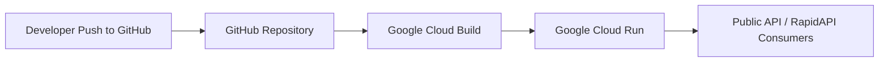

# ReplyCraft API

Version

v1.0 (Production-ready MVP)

Status

✅ Deployed
✅ Publicly accessible
✅ Health-monitored
🟡 Marketplace listing in progress (RapidAPI)
🟢 Production service running on Google Cloud Run

⸻

## CI/CD Pipeline

Code is pushed to GitHub, built using Google Cloud Build, and deployed automatically to Google Cloud Run as a new revision. Runtime configuration (env vars, scaling limits, secrets) is managed in Cloud Run and not stored in the repository.

⸻

1. Product Overview

ReplyCraft API is a production-ready FastAPI microservice that generates high-quality, channel-aware reply drafts for professional communication.

Unlike generic rewrite APIs, ReplyCraft adapts structure, tone, and formatting based on the destination channel (Email, Slack, LinkedIn), returning multiple stylistic options designed for real-world usage.

The service is designed to be:
	•	predictable
	•	testable
	•	low-latency
	•	marketplace-friendly
	•	monetisable as a standalone API

⸻

2. Problem Statement

Most text rewrite or “AI reply” APIs:
	•	ignore where the message will be sent
	•	produce outputs that feel generic or inappropriate
	•	lack deterministic behaviour needed for product integration
	•	are expensive or opaque to test and scale

Teams building productivity tools, assistants, or workflow automations need:
	•	channel-appropriate replies
	•	consistent output structure
	•	low-cost, reliable APIs
	•	clean contracts suitable for production use

⸻

3. Goals & Success Criteria

Primary Goals
	•	Generate channel-aware replies (Email, Slack, LinkedIn)
	•	Return multiple draft options per request
	•	Enforce constraints (length, phrasing, questions, emoji)
	•	Provide deterministic behaviour suitable for testing
	•	Be deployable and monitorable in production

Success Criteria
	•	API is publicly reachable and stable
	•	Health checks pass consistently
	•	Request/response contract is stable
	•	Can be listed and approved on RapidAPI
	•	Suitable for use in real products and demos

⸻

4. Non-Goals (for v1)
	•	No user accounts or authentication flows
	•	No UI or frontend
	•	No fine-tuning or custom models
	•	No billing logic inside the service
	•	No vendor lock-in to a single LLM provider

⸻

5. Current Features (Implemented)

### Core API

**POST /v1/reply/draft**
- Accepts message, channel, tone, context, constraints, options
- Returns:
  - 3 drafts: Direct, Friendly, Action-oriented
  - Detected tone
  - Channel applied
  - Confidence score
  - Notes for transparency

**GET /health**
- Lightweight liveness endpoint
- Used for monitoring and uptime checks

Channel-Aware Formatting
	•	Email
	•	Greeting
	•	Paragraph structure
	•	Professional sign-off
	•	Slack
	•	Concise phrasing
	•	Bullet points
	•	Optional emoji
	•	LinkedIn
	•	Light professional tone
	•	Short paragraphs
	•	Soft call-to-action

Deterministic Output
	•	Local generation logic for:
	•	zero-cost operation
	•	predictable tests
	•	fast responses
	•	Architecture ready for LLM swap-in later

⸻

6. Architecture & Tech Stack

Backend
	•	Python 3.12
	•	FastAPI
	•	Pydantic models
	•	Uvicorn

Deployment
	•	Dockerised
	•	Deployed on Google Cloud Run
	•	Public, unauthenticated access
	•	Port-safe (PORT environment variable)

Monitoring
	•	External health monitoring via RapidAPI Tests
	•	Scheduled every 6 hours (free tier)
	•	Validates:
	•	HTTP 200
	•	Application status
	•	Service identity

Testing
	•	Local pytest suite (unit + API tests)
	•	External smoke tests via RapidAPI

⸻

## 6.1 Operational Metrics (Current)

- Deployment: Google Cloud Run (fully managed)
- Cold start: Acceptable for marketplace usage
- Average response time: < 500ms (local generation)
- Availability monitoring: External (RapidAPI Tests, 6-hour cadence)

⸻

7. API Consumers (Target Users)
	•	Productivity tools
	•	Browser extensions
	•	Slack / email assistants
	•	CRM or customer support workflows
	•	Internal company tooling
	•	Job-seeker and professional networking tools

⸻

8. Monetisation Strategy

Marketplace-First (RapidAPI)
	•	Free tier: limited daily requests
	•	Paid tier(s): higher rate limits, commercial usage
	•	Zero billing logic inside service

Future Options
	•	SaaS wrapper (UI + auth)
	•	Enterprise deployment
	•	Usage-based billing via API gateway
	•	White-label integrations

⸻

9. Security & Reliability
	•	Optional API key support via environment variable
	•	Rate limiting per IP
	•	Stateless design
	•	No PII storage
	•	No user data persistence

⸻

10. Known Limitations
	•	No personalised writing style memory
	•	No multilingual support (English-only)
	•	No fine-grained tone taxonomy yet
	•	Local generation quality is good but not LLM-level

⸻

11. Roadmap & Next Steps

Short-Term (Next Iteration)
	•	RapidAPI listing submission & approval
	•	Add /v1/reply/draft RapidAPI test
	•	Add response time assertion to health test
	•	Polish RapidAPI listing copy & tags

Medium-Term
	•	Swap in OpenAI Responses API behind a feature flag
	•	Add usage metrics (request counts, latency)
	•	Add optional org-level API keys
	•	Add /meta or /info endpoint for marketplace trust

Long-Term
	•	UI demo / playground
	•	Style profiles (e.g. “formal”, “friendly”, “exec”)
	•	Multilingual support
	•	CI/CD with GitHub Actions
	•	Shadow deployment for model evaluation

⸻

12. Open Questions
	•	Should tone detection be exposed or hidden?
	•	Should confidence score be optional?
	•	Do we add per-channel pricing tiers?
	•	Should we offer a “single best draft” mode?

⸻

13. Summary

ReplyCraft API is a complete, production-ready MVP that demonstrates:
	•	strong product thinking
	•	clean API design
	•	real deployment & monitoring
	•	marketplace readiness

---

This PRD reflects the current, deployed state of ReplyCraft API and is intended to evolve alongside the service as additional capabilities, integrations, and monetisation paths are introduced.