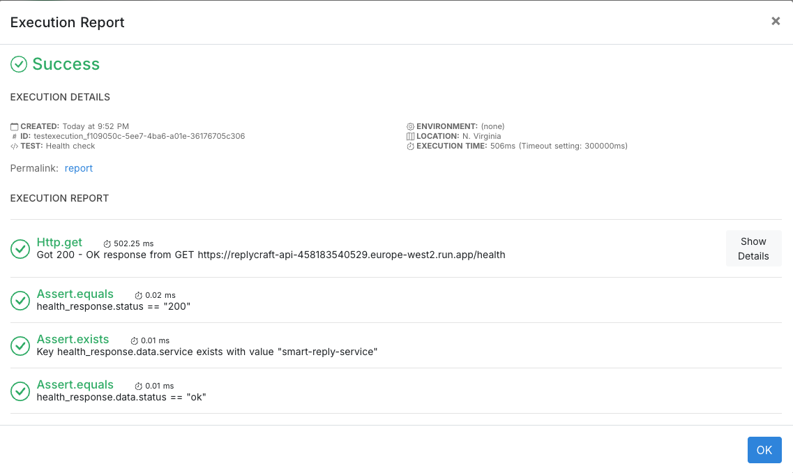

*fastapi · python · api · microservice · ai · llm · nlp · developer-tools · saas · productivity*

# ReplyCraft API

ReplyCraft API is a production-ready FastAPI microservice that generates high-quality, channel-aware reply drafts for **Email**, **Slack**, and **LinkedIn**.

Unlike generic rewrite APIs, ReplyCraft applies channel-specific formatting, tone control, and context-aware phrasing to produce replies that feel natural and appropriate to where they’ll be sent.

## Why ReplyCraft?

Most text-rewrite APIs treat all messages the same. ReplyCraft doesn’t.

ReplyCraft generates replies that respect **where** the message will be sent:
- **Email** → greeting, paragraphs, sign-off
- **Slack** → short, scannable, optional emoji
- **LinkedIn** → lighter tone, short paragraphs, soft call-to-action

Each request returns three distinct drafts (Direct, Friendly, Action-oriented) with transparent confidence scoring, making outputs predictable and easy to integrate into real products.

## Quickstart

Requirements: Python 3.11+, `pip`.

```bash
pip install -r requirements.txt
uvicorn app.main:app --reload --port 8000
```

Visit http://localhost:8000/health to verify the service is running,  
then open http://localhost:8000/docs for interactive API documentation.

### Example requests

Email:
```bash
curl -X POST http://localhost:8000/v1/reply/draft \
  -H "Content-Type: application/json" \
  -H "x-api-key: $API_KEY" \
  -d '{"incoming_message":"Could you share the Q1 metrics?","channel":"email","tone":"professional"}'
```

Example response (trimmed):
```json
{
  "drafts": [
    {
      "label": "Direct",
      "text": "Hi there,\n\nGiven this is for finance leadership, could you share the Q1 metrics?\n\nBest regards,\nTim"
    }
  ],
  "confidence_score": 0.85
}
```

Slack:
```bash
curl -X POST http://localhost:8000/v1/reply/draft \
  -H "Content-Type: application/json" \
  -H "x-api-key: $API_KEY" \
  -d '{"incoming_message":"Can someone review the PR today?","channel":"slack","tone":"concise","options":{"emoji":true}}'
```

LinkedIn:
```bash
curl -X POST http://localhost:8000/v1/reply/draft \
  -H "Content-Type: application/json" \
  -H "x-api-key: $API_KEY" \
  -d '{"incoming_message":"Enjoyed your post on data platforms—open to connecting?","channel":"linkedin","tone":"polite"}'
```

## Endpoints

- `GET /health` — basic liveness probe.
- `POST /v1/reply/draft` — generate three channel-aware reply drafts (Direct, Friendly, Action-oriented) with constraint enforcement and confidence scoring.

Example body:

```json
{
  "incoming_message": "Can you share the latest metrics for Q1?",
  "context": "Thread with finance leadership",
  "channel": "email",
  "tone": "professional",
  "constraints": {
    "max_words": 120,
    "must_include_question": true,
    "avoid_phrases": ["ASAP"]
  },
  "options": {
    "emoji": false,
    "uk_english": true
  }
}
```

Response shape:
```json
{
  "request_id": "string",
  "detected_tone": "neutral-professional",
  "channel_applied": "email",
  "drafts": [
    {"label": "Direct", "text": "..." },
    {"label": "Friendly", "text": "..." },
    {"label": "Action-oriented", "text": "..." }
  ],
  "notes": "Applied channel formatting; enforced constraints.",
  "confidence_score": 0.0
}
```

## Health monitoring (RapidAPI)

ReplyCraft includes an external health check configured via **RapidAPI Testing**.

The `/health` endpoint is monitored on a scheduled basis (every 6 hours on the free plan) to ensure the deployed service remains available and returns the expected response shape.

The health check validates:
- HTTP status code (`200`)
- Service identifier (`smart-reply-service`)
- Application status (`ok`)

This provides lightweight uptime assurance without introducing additional infrastructure or vendor lock‑in.



### Auth & rate limiting
- API key is required for draft generation. Set `API_KEY` in your environment and include `x-api-key` header in requests.
- Rate limit defaults to 60 req/min per IP; override with `SMART_REPLY_RATE_LIMIT_PER_MINUTE`.

Designed for safe public deployment and API marketplaces such as RapidAPI.

### Deployment & security model

ReplyCraft is designed for safe public deployment on API marketplaces.

- **Cloud Run access:** Public (no IAM required)
- **Request authorization:** Enforced at the application layer using an `x-api-key`
- **Marketplace controls:** Subscription, quotas, and abuse protection handled by RapidAPI
- **Secrets management:** API keys are injected at runtime via Google Secret Manager (never stored in the repo)

This separation of concerns keeps infrastructure simple while ensuring that only authorized clients can generate billable or compute‑intensive work.

### OpenAI integration (future-ready)
ReplyCraft currently generates deterministic drafts locally for zero-cost operation and testability.

The pipeline is already wired for OpenAI’s Responses API — enabling higher-quality generation later without changing request/response contracts or business logic.

## Example use cases

- Productivity tools and browser extensions
- Slack or email assistants
- CRM and customer support workflows
- Internal company communication tools
- Job-seeker and professional networking tools

## Docker

```bash
docker build -t smart-reply-service .
docker run -p 8000:8000 smart-reply-service
```

## License

This project is licensed under the **MIT License**.  
See the [LICENSE](LICENSE) file for full details.
